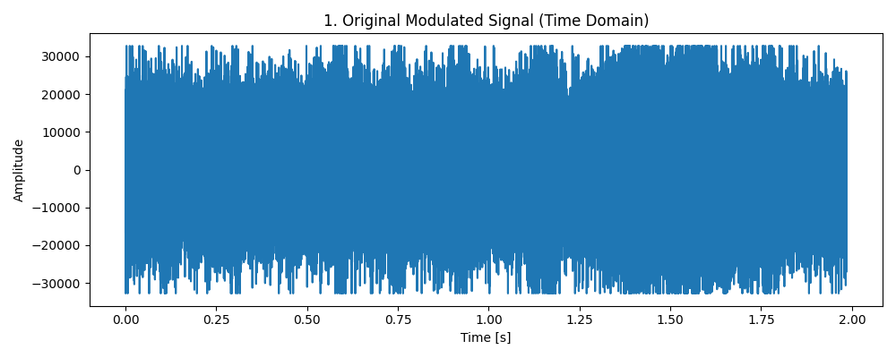
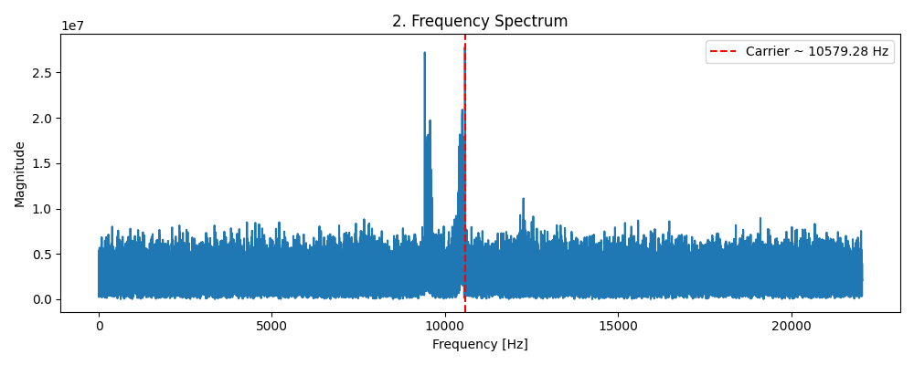
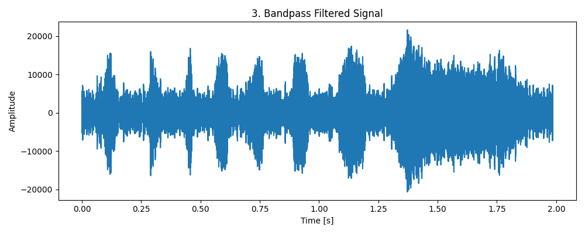
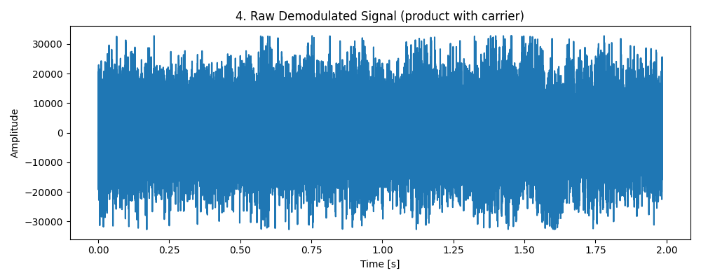
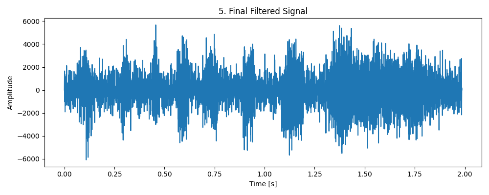
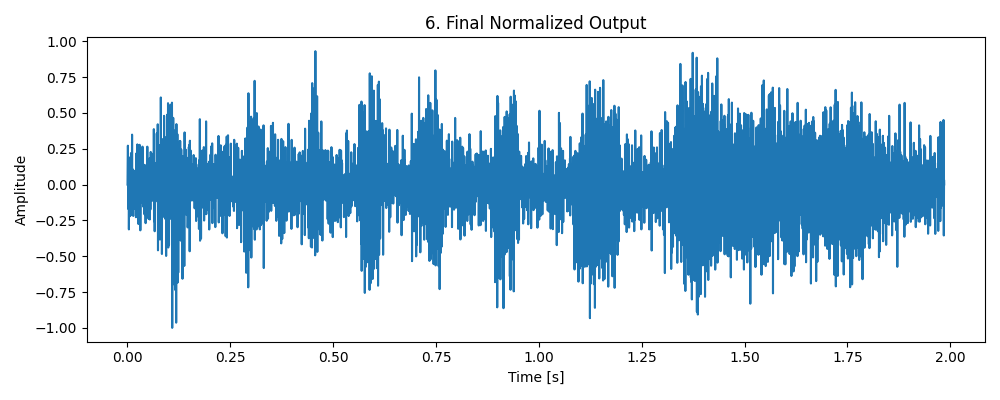

# 🎧 AM Demodulation and Noise Reduction Pipeline

This project processes a noisy amplitude-modulated (AM) audio signal and reconstructs the original clean waveform. The steps include frequency spectrum analysis, carrier frequency estimation, bandpass filtering, coherent demodulation, baseband filtering, and normalization.

It also visualizes each major stage of the process using plots.

---

## 📂 Input

- `modulated_noisy_audio.wav`: Noisy, amplitude-modulated input audio file.

---

## ⚙️ Code Walkthrough

### 1. 📚 Import Dependencies

```python
import numpy as np
import matplotlib.pyplot as plt
from scipy.io import wavfile
from scipy.fft import fft, fftfreq
import scipy.signal as sign
import soundfile as sf
```

These are standard Python libraries for digital signal processing and audio handling:

    NumPy: Numerical operations
    Matplotlib: Plotting signals and spectra
    SciPy: Fourier transforms and digital filtering
    SoundFile: Writing WAV audio

```python
def lowpass_filter(signal, cutoff, fs, order=5):
    b, a = sign.butter(order, cutoff / (0.5 * fs), btype="low")
    return sign.filtfilt(b, a, signal)

def highpass_filter(signal, cutoff, fs, order=4):
    nyq = 0.5 * fs
    normal_cutoff = cutoff / nyq
    b, a = sign.butter(order, normal_cutoff, btype='high')
    return sign.filtfilt(b, a, signal)

def bandpass_filter(signal, lowcut, highcut, fs, order=5):
    nyq = 0.5 * fs
    low = lowcut / nyq
    high = highcut / nyq
    b, a = sign.butter(order, [low, high], btype="bandpass")
    return sign.filtfilt(b, a, signal)
```
These use butterworth filters to clean specific frequencies

```python
fs, signal = wavfile.read("modulated_noisy_audio.wav") #fs - sampling frequency
N = len(signal)
yf = fft(signal)
xf = fftfreq(N, 1/fs)
peak_index = np.argmax(yf)
fc = xf_abs[peak_index]
```
Determines the carrier frequency fc

```python
cutoff = 0.4 * np.max(yf_abs) #Cutoff frequency
indices = np.where(yf[xf >= 0] > cutoff)[0]
band_start = xf[indices[0]]
band_end = xf[indices[-1]]
signal_initial_filter = bandpass_filter(signal, band_start, band_end, fs=fs)
```
Determining a cutoff frequency range for the signal by calculating which frequencies have energy >= 0.4*fc

```python
filtered = lowpass_filter(demodulated, cutoff=5000, fs=fs)
filtered = highpass_filter(filtered, cutoff=200, fs=fs)
filtered_real = filtered_real * np.sin(2*np.pi*t*200)

```
Lowpass filter removes high-frequency remnants of modulation
Highpass filter eliminates bass frequencies
Remodulation to lower all frequencis by 200Hz to make it better sounding

```python
filtered_normal = filtered_real / np.max(np.abs(filtered_real))
filtered_int16 = np.int16(filtered_normal * 32767)
wavfile.write("final_output.wav", fs, filtered_int16)
```
Normalize and save output










